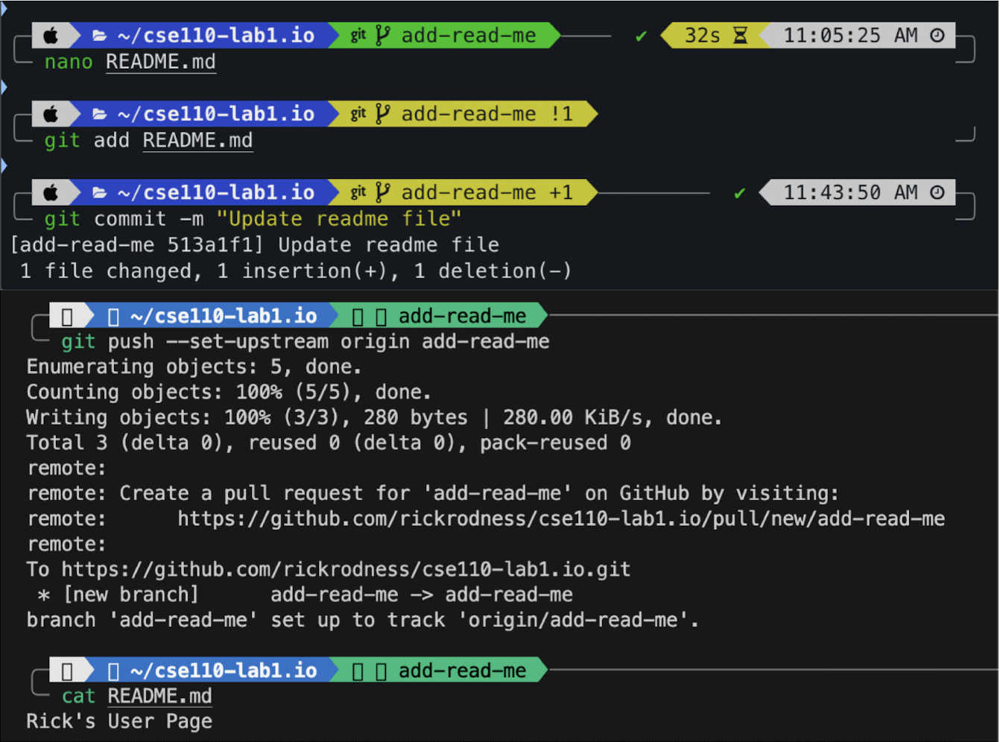
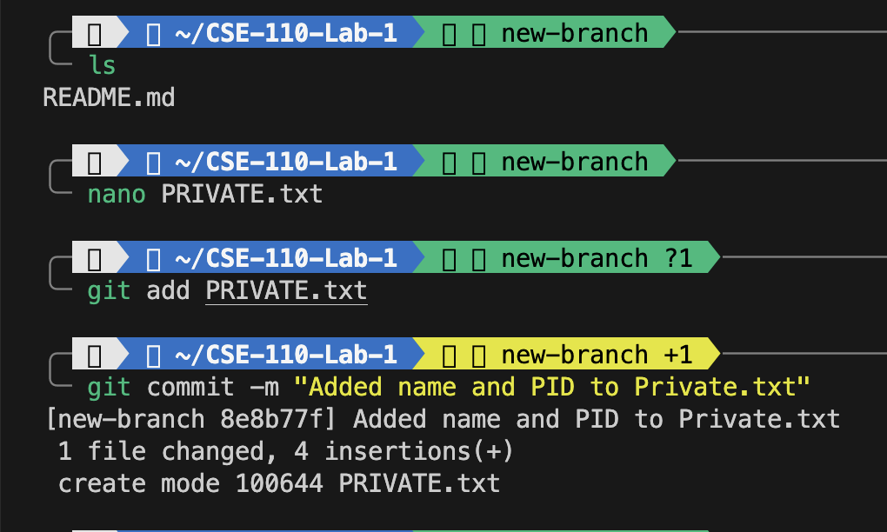

# Welcome to my Github User Page

My name is **Rick Rodness**, I am a 3rd year Computer Science major at **UC San Diego**, my passion lies in **machine learning** and **software development**. I thrive on the challenge of solving complex problems and transforming them into elegant software solutions. Throughout my academic journey, I have delved deep into languages such as **Java**, **Python**, and **C/C++**, equipping myself with a versatile toolkit for creating innovative software.

## My Academic and Research Interests

Currently, as an undergraduate researcher, my focus is on **Neural Radiance Fields (NeRF)** and **Gaussian Splatting** for advanced view synthesis. My focus is on implementing these popular differentiable rendering algorithms using **Slang**. Slang is a new GPU programming language developed by NVIDIA that supports automatic differentiation and a user-friendly interface, we are testing it on these algorithms to see if we can make them more efficient and accessible.

```python
# Example of a simple Python code snippet
def greet(name):
    print(f"Hello, {name}! Welcome to my GitHub page.")
```

What truly excites me is the opportunity to apply my skills in a professional software engineering role. I am particularly interested in positions that involve **algorithm design**, **data-intensive applications**, or the development of **user-friendly interfaces**. My goal is to contribute to software projects that not only present technical challenges but also make a meaningful impact.

### Connect With Me

I am always eager to connect with industry professionals, exchange insights, and explore potential collaborations. If you are seeking a dedicated and innovative software engineer who can bring value from day one, I would be delighted to connect with you.

- [LinkedIn Profile](https://www.linkedin.com/in/rick-rodness/)
- [GitHub Repository](https://github.com/rickrodness)

## Projects and Collaborations

- **Project 1**: An implementation of NeRF using Slang for advanced view synthesis. [More about this project](https://arxiv.org/abs/2003.08934)
- **Project 2**: Gaussian Splatting for real-time view synthesis. [Explore the code](https://github.com/graphdeco-inria/gaussian-splatting)

For more details on my projects and interests, feel free to explore my GitHub repositories or reach out directly through my LinkedIn profile.

Thank you for visiting my user page. Let's innovate together!

--- 


